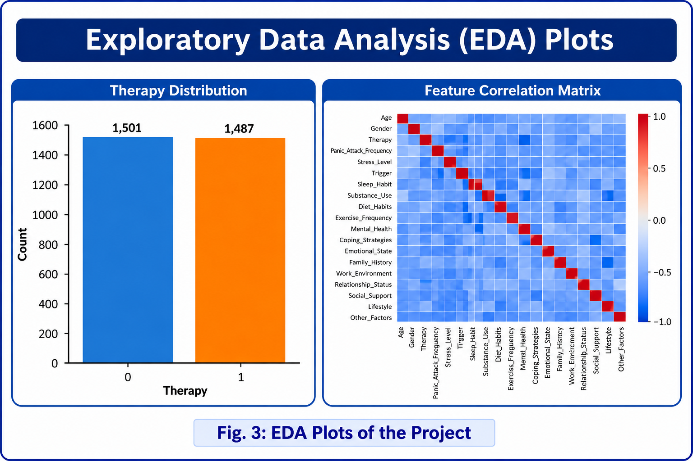
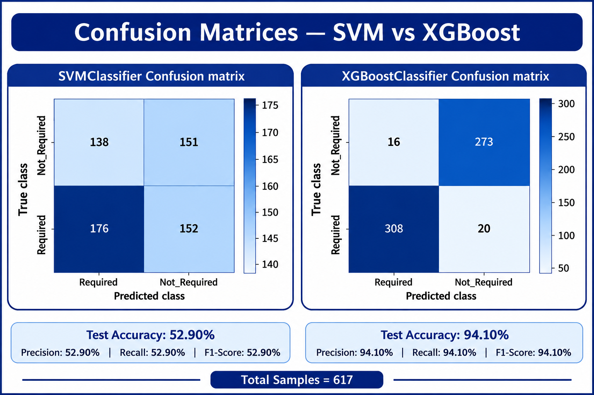

# Panic Attack Therapy Prediction Using Machine Learning

## Project Overview

Developed a machine learning classification system to predict therapy requirements based on panic-attack-related physiological, behavioral, lifestyle, and symptom features.

The project performs data preprocessing, exploratory data analysis, feature encoding, model training, and performance evaluation using Support Vector Machine (SVM) and XGBoost classifiers.

## Objective

The objective of this project is to analyze panic-attack-related factors and build a classification model capable of predicting whether therapy may be required.

## Project Workflow

Dataset
↓
Data Preprocessing
↓
Exploratory Data Analysis
↓
Feature Engineering
↓
Train-Test Split
↓
SVM & XGBoost
↓
Model Evaluation
↓
Therapy Prediction

## Technologies Used

- Python
- Pandas
- NumPy
- Scikit-learn
- XGBoost
- Matplotlib
- Seaborn
- Joblib

## Machine Learning Models

### Support Vector Machine (SVM)

Implemented SVM as a classification model for predicting therapy requirements.

### XGBoost

Implemented XGBoost as an advanced gradient boosting classifier and compared its performance with SVM.

## Model Evaluation

The models were evaluated using:

- Accuracy
- Precision
- Recall
- F1-Score
- Confusion Matrix

## Model Performance

| Model | Accuracy | Precision | Recall | F1-Score |
|-------|----------|-----------|--------|----------|
| SVM | 52.9% | 52.9% | 52.9% | 52.9% |
| XGBoost | 94.1% | 94.1% | 94.1% | 94.1% |

## Results

### Exploratory Data Analysis
The project includes analysis of therapy distribution, gender distribution, age distribution, panic attack frequency, stress levels, and feature correlations.
  

### Confusion Matrices
Confusion matrices were generated to evaluate the classification performance of both SVM and XGBoost models.


### Model Comparison
The comparative analysis demonstrates that XGBoost significantly outperformed the SVM classifier on the evaluated dataset.


## Project Structure
```text
Panic-Attack-Therapy-Prediction/
├── Dataset/
│   └── README.md
├── Results/
│   ├── EDA_Plots.jpg
│   ├── Confusion_Matrices.jpg
│   └── Model_Comparison.jpg
├── panic_attack_therapy_prediction.py
├── requirements.txt
├── .gitignore
└── README.md
```

## How to Run

### 1. Clone the repository

git clone https://github.com//Panic-Attack-Therapy-Prediction.git

### 2. Navigate to the project

cd Panic-Attack-Therapy-Prediction

### 3. Install dependencies

pip install -r requirements.txt

### 4. Run the project

python panic_attack_therapy_prediction.py

## Future Enhancements

- Hyperparameter tuning
- Cross-validation
- Feature importance analysis
- Additional machine learning algorithms
- Interactive prediction interface
- Model deployment as a web application

## Disclaimer
For educational and portfolio purposes only; not for medical diagnosis or treatment decisions.
