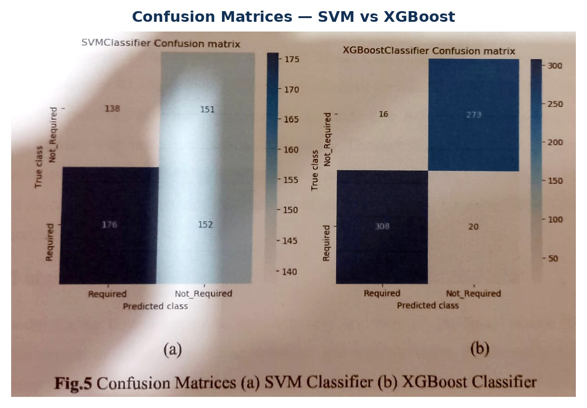
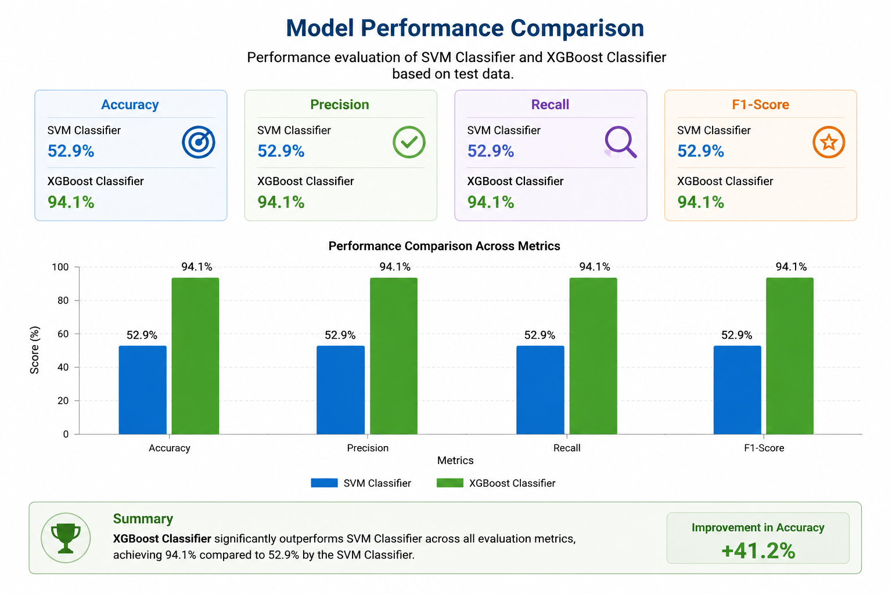

# Panic Attack Therapy Prediction Using Machine Learning

## Overview
A machine learning classification system developed to predict therapy requirements using panic-attack-related physiological, behavioral, and lifestyle features.

The original academic project's source repository and dataset were lost. The Python implementation here is reconstructed from the original hard-copy project report.

> **Disclaimer:** This is an academic/portfolio project and is not a medical diagnostic or treatment system.

## Objective
Predict whether therapy may be required based on panic-attack-related features.

## Workflow
Dataset → Preprocessing → EDA → Train/Test Split → SVM & XGBoost → Evaluation → Prediction

## Models
- Support Vector Machine (SVM)
- XGBoost

## Evaluation Metrics
Accuracy, Precision, Recall, F1-Score, and Confusion Matrix.

## Reported Results
| Model | Accuracy |
|---|---:|
| SVM | 52.9% |
| XGBoost | 94.1% |

## Results

### Exploratory Data Analysis
![EDA

### Confusion Matrices


### Model Comparison


## Technologies
Python, Pandas, NumPy, Scikit-learn, XGBoost, Matplotlib, Seaborn, Joblib.

## Project Structure
```text
Panic-Attack-Therapy-Prediction/
├── Dataset/
│   └── README.md
├── Results/
│   ├── EDA_Plots.jpg
│   ├── Confusion_Matrices.jpg
│   └── Model_Comparison.jpg
├── panic_attack_therapy_prediction.py
├── requirements.txt
├── .gitignore
└── README.md
```

## Dataset
The original dataset is unavailable. Do not use a replacement dataset and claim it is the original. If recovered, place it at `Dataset/Panic_Attack.csv`.

## Run
```bash
pip install -r requirements.txt
python panic_attack_therapy_prediction.py
```

## Future Work
Larger datasets, cross-validation, hyperparameter tuning, additional classifiers, feature-importance analysis, and application deployment.

## Disclaimer
For educational and portfolio purposes only; not for medical diagnosis or treatment decisions.
